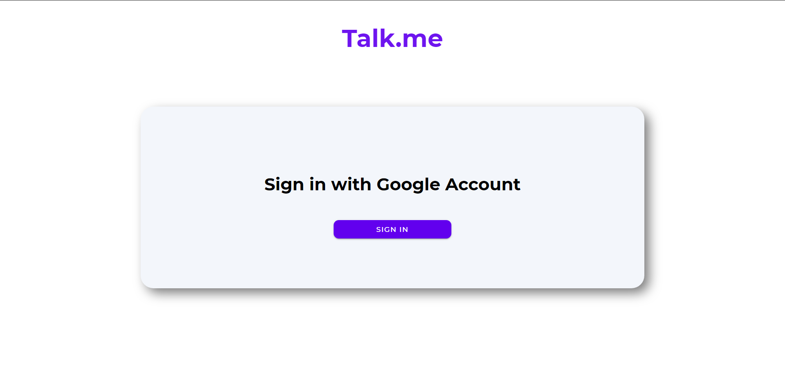
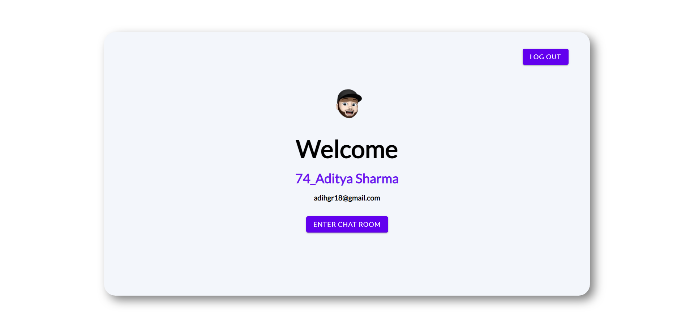
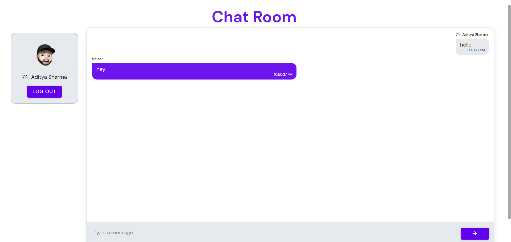
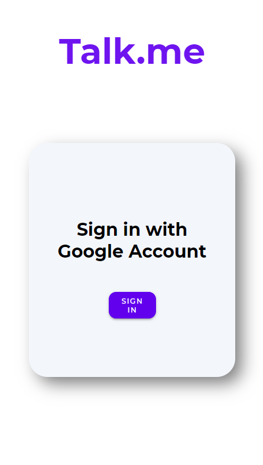
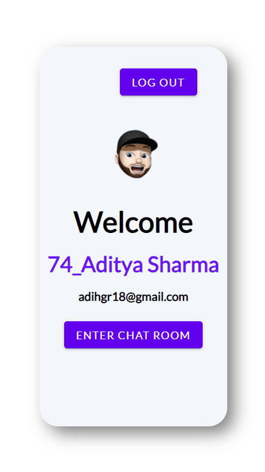
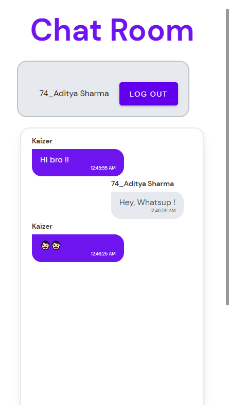

# Chat Room App

This project was built using nodeJs, socket.io and hosted on hereoku.

##

```
NPM packages used
- socket.io
- cookie-session
- passport-google-oauth2
- passport
- nodemon
- mongoose
- express
- ejs
- dotenv
```

For Live demo, [click here:](https://talk-me-chat.herokuapp.com/)

## Screenshots




<br>
<h3> Mobile View</h3>




